## Configuration
This document explains how to use the app's configuration file.

The configuration file `config.json` can be found in the folder `Optimizing-Sedation/frontend/src/config/`. 

There are several settings that you can configure within this file. 

### Table of Contents
- [General Configuration](#general-configuration)
    - [Launch Mode](#launch-mode)
    - [Maximum Size](#maximum-size)
    - [Sandbox](#sandbox)
- [Search Codes](#search-codes)
    - [Name](#name)
    - [Coding](#coding)
        - [System](#system)
        - [Codes](#codes)
    - [Resources](#resources)

## General Configuration
General configuartion is made up of the launch mode, maximum size, and sandbox settings. Each setting is described in more detail below. The following is an example of what the general configuration object could look like in the `config.json` file. 

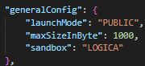

### Launch Mode
The launch mode of the application can be configured. The launch mode be set to either `PUBLIC` or `PRIVATE`, depending on the type of app that is being launched. Changing this setting will change the way the app is launched. If the launch mode is set to `PRIVATE`, a `CLIENT SECRET` will need to be provided. 

To change the launch mode modify the `generalConfig.launchMode` property within the `config.json` file. 

### Maximum Size 
The maximum size of data that can be used in the API requests can be configured. This can be useful since API requests have a maximum size limit that can be handled. So this property can be configured to avoid any errors related to exceeding the request size limit. The size is in bytes.

To change the maximum request size modify the `generalConfig.maxSizeInByte` property within the `config.json` file. 

### Sandbox
There is a sandbox property that can be modified based on which sandbox the app is using. Sandboxes have different behaviours, so changing the app behaviours accordingly can help avoid errors. The sandbox property can be set to `CERNER`, `LOGICA`, or `SMART_LAUNCHER`.

To change the sandbox modify the `generalConfig.sandbox` property within the `config.json` file.

## Search Codes
To populate the dashboard, the application uses keywords and medical codes to search for relevant data. 

Modifying this section of the config file will result in changes to the table on the dashboard. Each object in the `searchCodes` array corresponds to a row in the table. The `searchCodes` array can be used to add, remove, or modify rows in the table. The following are the different properties that can be changed. 

To add a new row to the table on the dashboard, a new object containing all of the below properties must be created. Similarly, to delete a row from the table on the dashboard, the row's corresponding object must be deleted. 

The following is an example to help illustrate this.  

The rows in the table are colour coded to match the objects in the config file that they correspond to. The "EEG" row in the table corresponds to the `searchCodes` object in the yellow box. The "ENT" row in the table corresponds to the `searchCodes` object in the green box. If the object in the yellow box were deleted, the "EEG" row on the table would be deleted. If the object in the green box were deleted, the "ENT" row on the table would be deleted.
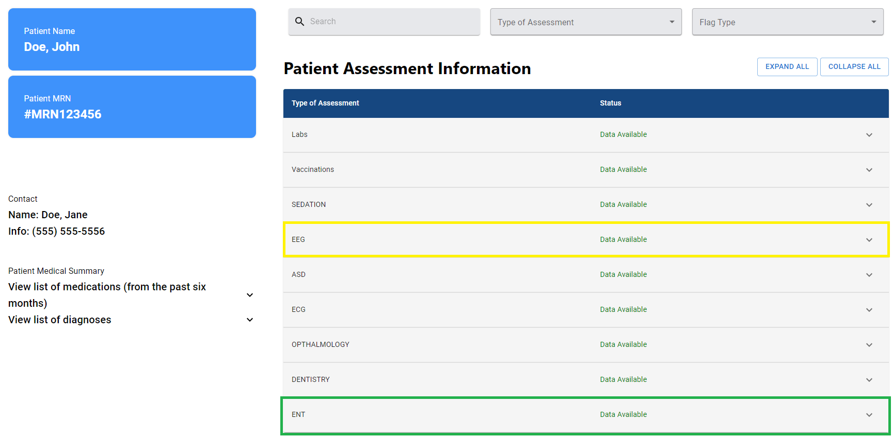
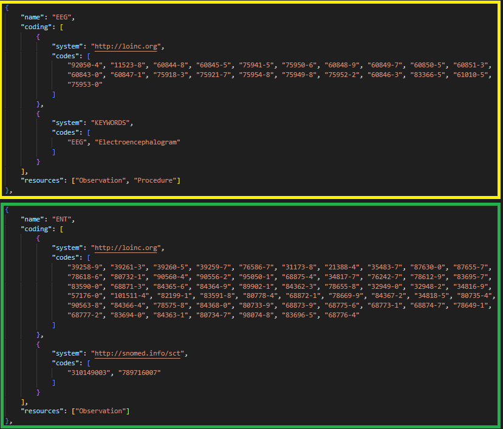

### Name
This property specifies the name of the medical assessment. This name is displayed in the `Type of Assessment` column of the table on the dashboard. 

The names in the `Type of Assessment` column in the dashboard's table are determined by the `name` property in the config file. The name displayed in the table can be changed by editing the name property in the config file.

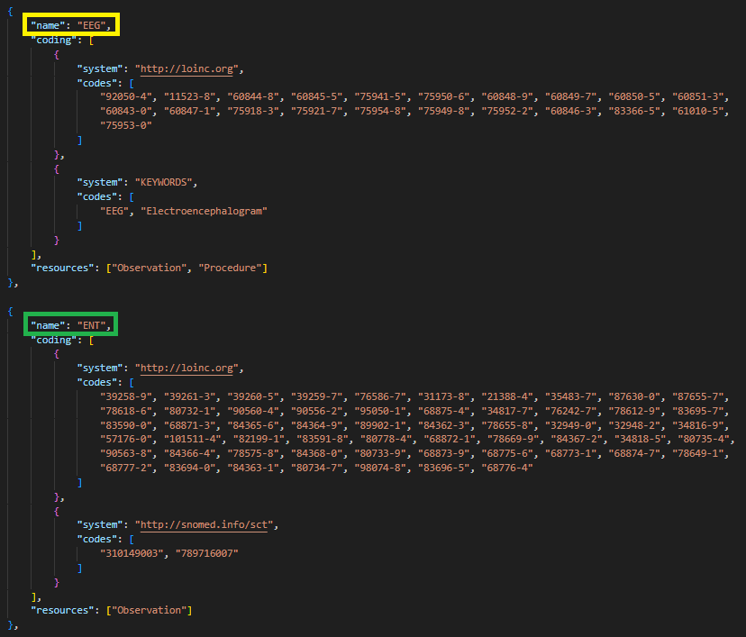

### Coding
The coding property contains both the code system and the codes themselves.

The medical codes and keywords found in the `coding` property of the configuration file are used to search for data. The data that is retrieved from these searches is displayed in the dropdowns of rows in the table.

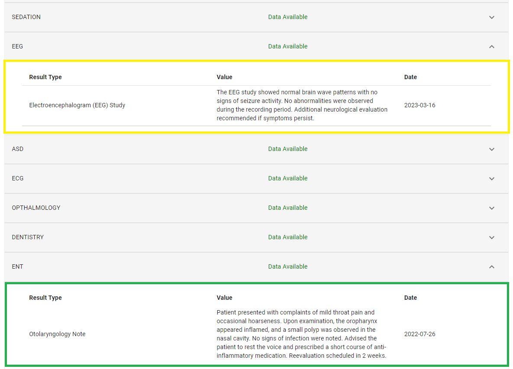
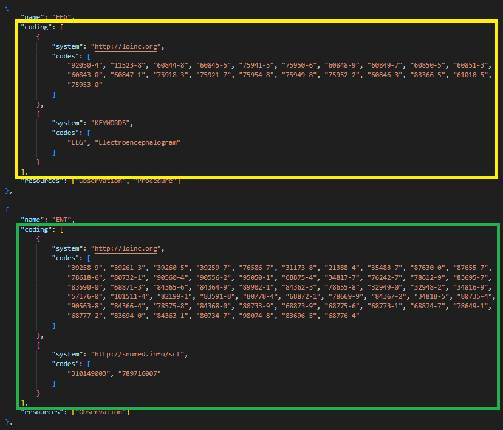

#### System
This property specifies the code system that the codes are part of. 

The `system` can be either be a medical code system or it can be set to `KEYWORDS`. If the system is set to `KEYWORDS`, then the words in the `codes` field will be used to search for data that contains those specific words. 

The following are examples of the `system` property being set to medical code systems.  

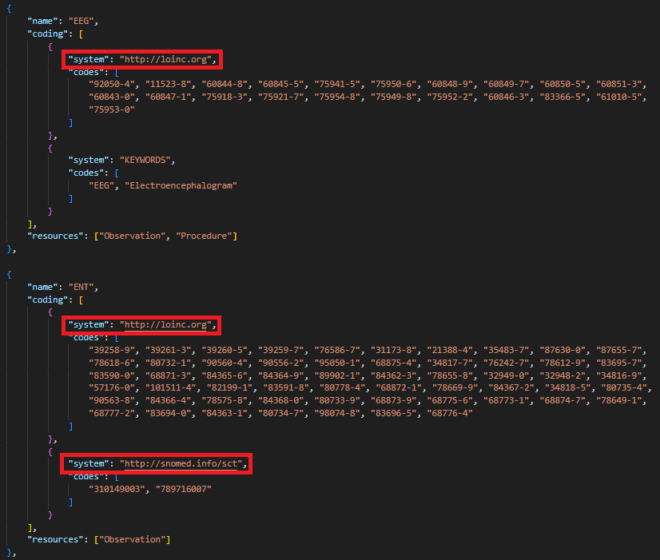

The following is an example of the `system` property being set to `KEYWORDS`. In this example, the keywords that will be used to search for data are: "EEG" and "Electroencephalogram".

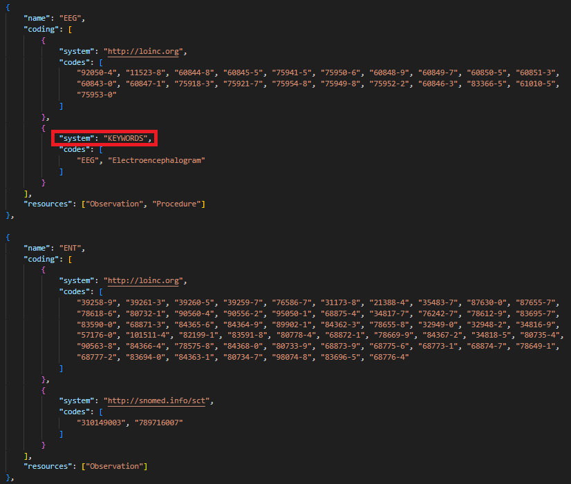

#### Codes
This property is an array of items that are used to search for data. The array can either contain medical codes if the corresponding `system` is a medical code system, or it can contain keywords if the corresponding `system` is set to `KEYWORDS`. 

When searching for data, any pieces of data on the server that have a code or keyword that matches one from the `codes` array will be processed and displayed in the corresponding table row on the dashboard.

The following image is an example of medical codes being used to search for data to be displayed on the dashboard. 

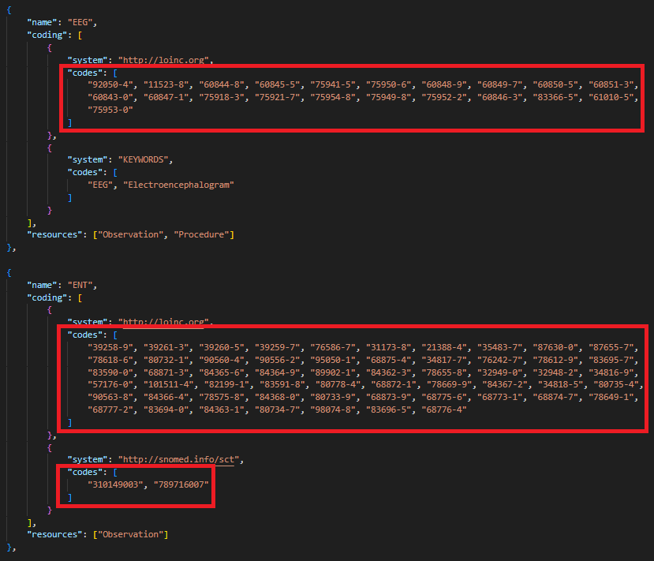

The following image is an example of keywords being used to search for data to be displayed on the dashboard. 

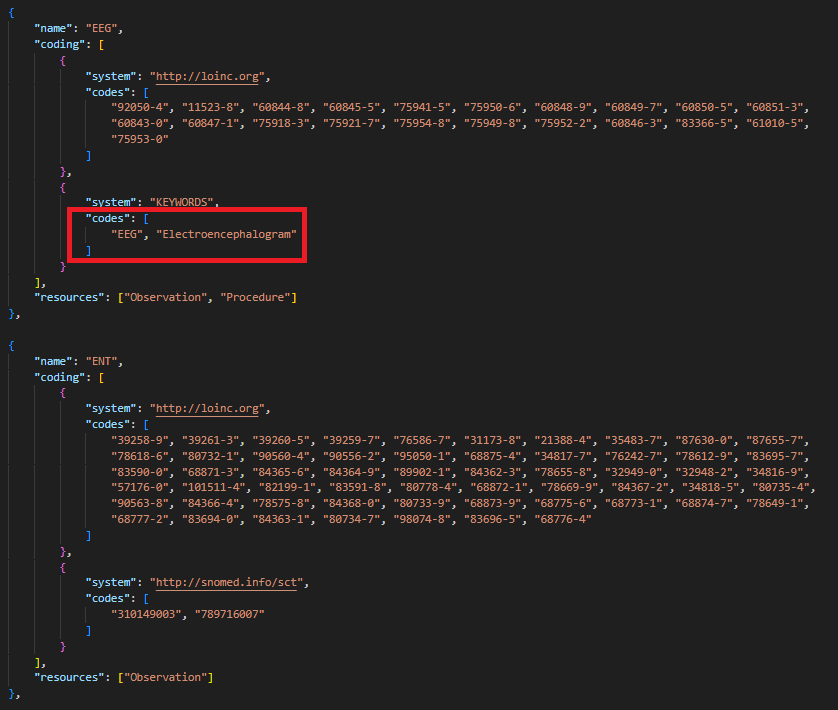

### Resources
This property is an array of FHIR resources. Each resource in the array will be searched for data. Changing this array will change which FHIR resources will be searched for data.

In the image below, the green box contains just one listed resource, which means that only that particular resource will be searched for data. However, in the yellow box, multiple resources are listed, meaning that a search for data will be conducted across all of the listed resources.

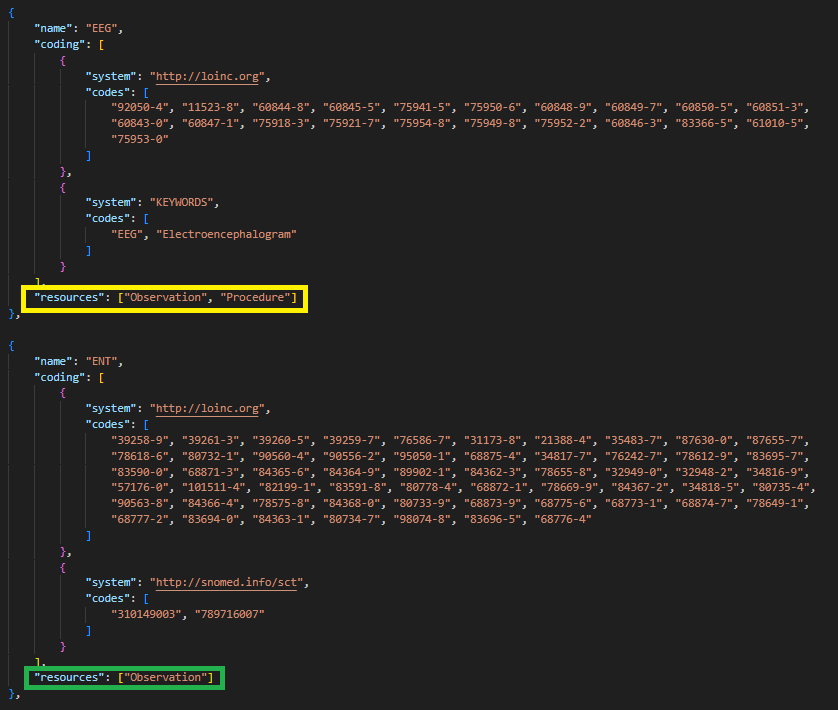

