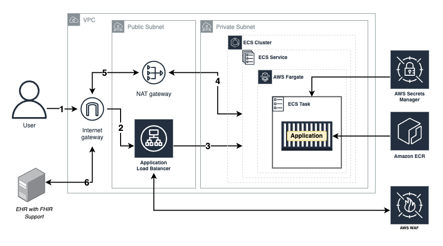

# Requirements

Before you deploy, you must have the following installed on your device:

- [git](https://git-scm.com/downloads)
- [git lfs](https://git-lfs.com/)
- [AWS Account](https://aws.amazon.com/account/)
- [GitHub Account](https://github.com/)
- [AWS CLI](https://aws.amazon.com/cli/)
- [AWS CDK](https://docs.aws.amazon.com/cdk/latest/guide/cli.html)

If you are on a Windows device, it is recommended to install the [Windows Subsystem For Linux](https://docs.microsoft.com/en-us/windows/wsl/install), which lets you run a Linux terminal on your Windows computer natively. Some of the steps will require its use. [Windows Terminal](https://apps.microsoft.com/store/detail/windows-terminal/9N0DX20HK701) is also recommended for using WSL.

## Deployment walkthrough

### Table of Contents

- [Requirements](#requirements)
  - [Deployment walkthrough](#deployment-walkthrough)
    - [Table of Contents](#table-of-contents)
  - [Step 1: Clone The Repository](#step-1-clone-the-repository)
  - [Step 2: Application Configuration](#step-2-application-configuration)
  - [Step 3: Local Deployment](#step-3-local-deploayment)
  - [Step 4: Cloud Deployment](#step-2-cloud-deployment)
    - [Step 1: Install Dependencies](#step-1-install-dependencies)
    - [Step 2: Upload Secrets](#step-2-upload-secret)
    - [Step 3: CDK Deployment](#step-3-cdk-deployment)
    - [Extra: Taking down the deployed stacks](#extra-taking-down-the-deployed-stacks)
  - [Step 5: Register Application in Sandbox](#step-5-register-application-in-sandbox)
## Step 1: Clone The Repository

First, clone the GitHub repository onto your machine. To do this:

1. Create a folder on your computer to contain the project code.
2. For an Apple computer, open Terminal. If on a Windows machine, open Command Prompt or Windows Terminal. Enter into the folder you made using the command `cd path/to/folder`. To find the path to a folder on a Mac, right-click on the folder and press `Get Info`, then select the whole text found under `Where:` and copy with ⌘C. On Windows (not WSL), enter the folder on File Explorer and click on the path box (located to the left of the search bar), then copy the whole text that shows up.
3. Clone the GitHub repository by entering the following:

```bash
git clone https://github.com/UBC-CIC/Optimizing-Sedation.git
```

The code should now be in the folder you created. Navigate into the root folder containing the entire codebase by running the command:

```bash
cd Optimizing-Sedation
```
## Step 2: Application Configuration
Before hosting and launching the application, the configuration of the application needs to be set up first.

Please follow this [application configuration guide](./Configuration.md) to set up the configuration.


## Step 3: Local Deployment
For local deployment, we only need to add an ```.env``` file at ```Optimizing-Sedation/frontend/```. It should have the following values (one doesn't have to apply ```REACT_APP_CLIENT_SECRET``` if the app is configured to run ```PUBLIC``` mode):

```bash
REACT_APP_CLIENT_SECRET=<client-secrete>
REACT_APP_CLIENT_ID=<client-id>
```

This value can be found by following [Step 5: Register Application in Sandbox](#step-5-register-application-in-sandbox).

Then, one can install all packages using the command below at ```Optimizing-Sedation/frontend/```, 
```bash
npm install
```

Afterward, one can run the application by running,
```bash
npm start
```

## Step 4: Deployment



It's time to set up everything that goes on behind the scenes! For more information on how the backend works, feel free to refer to the Architecture Deep Dive, but an understanding of the backend is not necessary for deployment.

### Step 1: Install Dependencies

The first step is to get into the backend folder. Assuming you are currently still inside the root folder `Optimizing-Sedation/`, this can be done with the following commands:

```bash
cd backend/cdk
```

Now that you are in the backend directory, install the core dependencies with the following command:

```bash
npm install
```

### Step 2: Upload Secrets

To store application secrets such as client ID and client secret, we are going to use AWS Secret Manager. Run the following command and make sure to change the information that is in <>.

```bash
aws secretsmanager create-secret --name SedationSecrets --secret-string '{"REACT_APP_CLIENT_SECRET":"<Your-Sandbox-Client-Secret>", "REACT_APP_CLIENT_ID":"<Your-Sandbox-Client-ID>"}' --profile <Your-profile-name>

```

### Step 3: CDK Deployment

Initialize the CDK stacks (required only if you have not deployed this stack before). Note this CDK deployment was tested in `ca-central-1` region only.

```bash
cdk synth --profile <aws-profile-name>
```

You may choose to run the following command to deploy the stacks all at once. Please replace `aws-profile-name` with the appropriate AWS profile used earlier:

For CDK deployment, we are going to do the following:
1. Create Elastic Container Registry (ECR) name 'docker-repo'
2. Create a Docker image and push it to ECR
3. Create a Self-Signed SSL Certificate and push it to IAM
4. Create a stack for hosting

Make sure to fill necessary information in the <>. 

Most of the commands assume you are in ```Optimizing-Sedation/backend/cdk/``` directory unless the instruction says to change the directory.

#### 1. Create Elastic Container Registry (ECR)

This will create a repository called 'docker-repo'. It is important to not change this name since the script in step 2 will need that.

First, initialize CDK stacks based on your region (only required if you have not deployed any resources yet).

```bash
cdk bootstrap aws://<YOUR_AWS_ACCOUNT_ID>/<YOUR_AWS_ACCOUNT_REGION> --profile <your-profile-name>
```

Then, run the following command to create an ECR repository.

```bash
cdk deploy Create-ECR --profile <aws-profile-name>
```
#### 2. Push Docker Image to ECR

Once a repository is created, we can create and push Docker images. Luckily, this is done for you. You can check in the ```Optimizing-Sedation/backend/scripts/push_image.sh``` for more detail.

To run a script file, you might need to change file mode to execution mode.

```bash
chmod +x ../scripts/push_image.sh
```

Now, let's create a Docker image and push it to ECR. Make sure to change everything in the <>.

```bash
../scripts/push_image.sh <aws-profile-name> <aws-region> <aws-account-number> 
```

Example, 

```bash
../scripts/push_image.sh Sedation_Dev_1 ca-central-1 0123456789
```
Note: you can reuse this file to push to ECR every time you make changes on the dashboard and make those changes live.

#### 3. Create Self-Signed SSL Certificate and push to IAM
Some sandbox requires the app to have an ``https://`` for security purpose. Therefore, we need to add a listener for ```https://``` on port 443. Adding ```https://``` requires a certificate; since we do not use a domain name, we need to add a self-signed SSL certificate and attach that with ALB listener. 

Below are steps to create and upload a certificate following a [Medium post by Francis Yeo](https://medium.com/@francisyzy/create-aws-elb-with-self-signed-ssl-cert-cd1c352331f). 
**Note,**  please follow the steps below as there are some slight changes from the tutorial.

Create a self-signed SSL certificate. Make sure one is in the folder where one wants to save the certificate.
```bash
openssl req -x509 -nodes -days 365 -newkey rsa:2048 -keyout privateKey.key -out certificate.crt
```

Confirm certificate created (optional).
```bash
openssl rsa -in privateKey.key -check
openssl x509 -in certificate.crt -text -noout
```

Convert to ```.pem``` encoded file.
```bash
openssl rsa -in privateKey.key -text > private.pem
openssl x509 -inform PEM -in certificate.crt > public.pem
```

Push certificate to AWS IAM, this assumes that AWS configuration is installed on the local computer and the IAM user is signed in with the required permission to upload the certificate.
```bash
aws iam upload-server-certificate --server-certificate-name Sedation-Self-Signed-SSL-Certificate --certificate-body file://public.pem --private-key file://private.pem --profile <aws-profile-name>
```

Sample output
```bash
{
    "ServerCertificateMetadata": {
        "Path": "/",
        "ServerCertificateName": "Sedation-Self-Signed-SSL-Certificate",
        "ServerCertificateId": "ABCDEFGHIJK",
        "Arn": "arn:aws:iam::0123456789:server-certificate/Sedation-Self-Signed-SSL-Certificate",
        "UploadDate": "2023-09-12T17:29:03+00:00",
        "Expiration": "2024-09-10T18:40:06+00:00"
    }
}
```

Store the certificate ARN, ```ServerCertificateMetadata.Arn```, somewhere as we going to use it later. In this case, it would be, 
```bash
"arn:aws:iam::0123456789:server-certificate/Sedation-Self-Signed-SSL-Certificate"
```

#### 4. Create Host Stack

This step will create a CloudFormation stack to host the dashboard on ECS. Assume you are in ```Optimizing-Sedation/backend/cdk/``` directory. This will take some time.

Replace the ```<certificate-arn>``` with the certificate ARN from [step 3.](#3-create-self-signed-ssl-certificate-and-push-to-iam).
```bash
cdk deploy ECSHost --profile <aws-profile-name> --parameters ECSHost:certificateARN=<certificate-arn>
```

Example,

```bash
cdk deploy ECSHost --profile profile1 --parameters ECSHost:certificateARN=arn:aws:iam::0123456789:server-certificate/Sedation-Self-Signed-SSL-Certificate
```
After deployment is completed, look for 'CloudFront URL:' in the terminal. This is the host link for the application.

This is an example of an output
```bash
Outputs:
ECSHost.HostWithLoadBalancerDashboardLoadBalancerDNSD373F489 = FargateService-LoadBalancer-1234567.ca-central-1.elb.amazonaws.com
ECSHost.HostWithLoadBalancerDashboardServiceURL34B8FA55 = https://FargateService-LoadBalancer-1234567.ca-central-1.elb.amazonaws.com
```

This is the expected Smart on Fhir URLs:
```bash
Launch URL: [domain]/smartAuth
Redirect URL: [domain]/
```

Based on the CloudFront URL above, we would have
```bash
Launch URL: https://FargateService-LoadBalancer-1234567.ca-central-1.elb.amazonaws.com/smartAuth
Redirect URL: https://FargateService-LoadBalancer-1234567.ca-central-1.elb.amazonaws.com/
```

### Extra: Taking down the deployed stacks

To take down the deployed stack for a fresh redeployment in the future, navigate to AWS Cloudformation, click on the stack(s), and hit Delete. Please wait for the stacks in each step to be properly deleted before deleting the stack downstream. The deletion order is as follows:

1. `Create-ECR`
2. `ECSHost`

To delete Secret Manager, navigate to Secret Manager and select 'SedationSecrets' to delete.

## Step 5: Register Application in Sandbox
After the application is hosted whether it is on AWS or localhost, one needs to register the application on a sandbox is was set in the configuration file in [step 2.](#step-2-application-configuration) The sandboxes that this app has tested on are: 

* Cerner Sandbox
* SMART Launcher Sandbox
* Logica Sandbox

#### Cerner Sandbox
Cerner Sandbox contains pre-existing patients and has its own server configuration. Below are the steps to register for the app:
1. Go to this link https://code-console.cerner.com/, and create an account there.
2. On the main page, click on ```Go to My Applications```
3. On My Applications page, click ```+ New Application```
4. Fill out the required information: 
  * ```Application Type``` choose 'Provider'
  * ```Type of Access``` choose 'Online'
  * ```Application Privacy```chosen based on the configured launch mode (PRIVATE means 'Confidential' in Cerner)
  * ```Redirect URI``` put '[domain]/'; for example 'http://localhost:3000/'
  * ```SMART® Launch UR``` put '[domain]/smartAuth/'; for example 'http://localhost:3000/smartAuth/'
  * ```Default FHIR® Version``` choose 'R4'
  * ```RequiredSelect a Product Family``` choose 'Millennium'
  * ```Select Products``` choose 'Ignite APIs for Millennium: FHIR R4, All'
  * API Access choose the following

  

5. Once registered, select the registered app and look for ```Client ID```; for client secret look for something like ```Cerner Central System Account Details``` and follow that link to get the client secret. This is the information one need to add to ```.env``` file or AWS Secret Manager
6. Click on ```Test Sandbox``` and follow the instructions on the pop-up (choosing a patient) to launch the app.

#### Smart Launcher Sandbox
This sandbox is similar to Cerner, and it allows users to choose different launch modes and provides flexibility in SMART configuration. The step below is going with the simplest configuration:
1. Go to this link https://launch.smarthealthit.org/ and select ```Client Registration & Validation``` tab
2. Choose the ```Client Type``` based on one setup on the configuration file
3. Keep everything else as default and put '[domain]/smartAuth/' in 
```App's Launch URL```. The default setup allows one to pass any client secret and client ID. Therefore, in the ```.env``` or AWS Secrete Manager, one can add any string
4. Then click ```Launch``` to launch the app

#### Logica Sandbox
Logica sandbox allows us to add patient data and other configurations regarding FHIR resources.
1. Go to this link https://sandbox.logicahealth.org/, and register your account or sign in
2. On the dashboard page (https://sandbox.logicahealth.org/dashboard), select ```NEW SANDBOX``` and fill out the required information. Please choose 'FHIR R4' as a ```FHIR Version```.
3. On Apps tab, click ```+ icon``` to register an new app.
4. Fill in the required information similar to the instruction in Cerner sandbox config; in the ```Scopes```section add the scopes below. From our experience, there is some problem with Logica's Confidential Client mode; we suggest using Public Client mode.

```bash
patient/Patient.read patient/Observation.read patient/DiagnosticReport.read patient/Immunization.read patient/MedicationRequest.read patient/Condition.read patient/Procedure.read launch online_access openid profile
```
5. After registering the application, one could hover on the app and click on ```SETTINGS``` to get the client ID
6. To launch the app, hover on the app then select ```LAUNCH``` and choose the correct patient and practitioner

We have some test patient data that could be uploaded to Logic sandbox using [this guide](./TestDataDeployment.md).