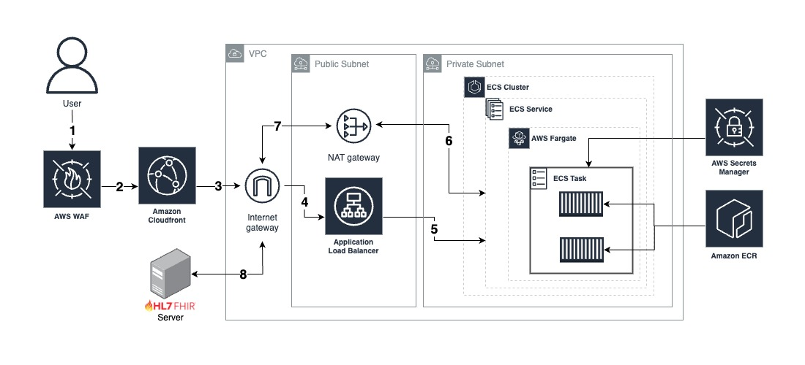

# Networking Specifications

This document explains the networking information for this project.

### Table of Contents:

1. [Smart on FHIR Schema](#1-Smart-on-FHIR-Schedma)
2. [Hosting Network Schema](#2-Hosting-Network-Schema)
3. [Other Info](#3-other-info)

### 1. Smart on FHIR Schema


The diagram above depicts the authorization workflow of Smart on FHIR. There are five major targets of the process: EHR, application authentication, FHIR server, authorization server, and application dashboard. 

The application expose two paths: 
* **Application Authentication [www.domainName/smartAuth]** - use as entry point to send application's secret informations (e.g., client id and client secret), redirect URL, and request scope.
* **Application Dashboard [www.domainName/]** - use to display information of a patient.

This applicaiton is intented to launch from an EHR not as a standalone app. Therefore, a user would launch the app from an EHR or test sandbox like Cerner, Smart Launcher, and Logica. 

### 2. Hosting Network Schema


The diagram above shows the network architecture of the application using AWS. User would request to an edge location of CloudFront which then forward to an Application Load Balancer (ALB). The ALB then check health status of an ECS task and forward the request to a container that runs on AWS Fargate. 

When a request is recieved by the application in a contianer, it then request to for authroization and FHIR server for data.

### 3. Other Info
**Note**: [AWS CDK](https://docs.aws.amazon.com/cdk/v2/guide/home.html) is the official Infrastructure-as-Code toolchain by AWS that provision cloud resources with CloudFormation behind the scene. Feel free to look in the CDK code under ```Optimizing-Sedation/backend/cdk/```

* 1 VPC with 2 Availability Zones, each availability zone consist of 1 public and 1 private subnet (total of 2 public and 2 private subnets for the entire VPC)
* VPC CIDR range is `10.0.0.0/16`
* 1 Nat Gateway each of the public subnets.
* 1 Internet Gateway.
* Security groups:
    * AWS ALB - security group with inbound rule only from CloudFront via HTTP, and outbound rule only to AWS ECS Service security group at port 3000.
    * AWS ECS Service - security group with inbound rule only from AWS ALB security group at port 3000, and outbound rule for all traffice. 
* Application Load Balancer for the ECS Service is created in the public subnets
* Global AWS Web Application Firewall with the following rules
    * AWSManagedRulesAmazonIpReputationList
    * AWSManagedRulesCommonRuleSet
    * AWSManagedRulesKnownBadInputsRuleSet

