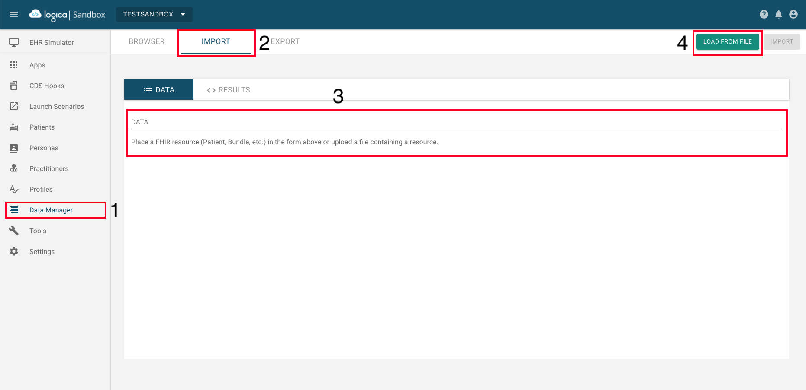

# Patient Test Data Deployment Guide
This deployment guide will show how to load costume data into a sandbox. From our experience, Logica Sandbox offers this feature which this guide will focus on. This document will go through the following:

* [Prepare Data](#1-prepare-data)
* [Logica Sandbox Navigation Load Data](#logica-sandbox-navigation--load-data)

## Prepare Data
We have prepared some patient data that could be used to load to Logical. The test data is located at ```Optimizing-Sedation/testdata/```. The ```/dataByResource/``` contains data specific to each medical code; please make sure to modify the test accordingly.

One could create patient data that needs to follow the FHIR resource structure at https://build.fhir.org/resourcelist.html.

It is important to attach medical codes with the test data which could be any of the following lists: 
1. LOINC, https://loinc.org/search/
2. SNOMED CT, https://infocentral.infoway-inforoute.ca/en/standards/canadian/snomed-ct
3. Cerner Code, https://fhir.cerner.com/millennium/r4/proprietary-codes-and-systems/

A more code system is at https://terminology.hl7.org/codesystems.html.

## Logica Sandbox Navigation & Load Data
Assume one created a sandbox and navigated to the correct sandbox. 

Based on the picture below, navigate to number 1 ("Data Manager") and click on "Import" (2). There are two options to include test data. One can copy test data in JSON and paste it into number 3, then click IMPORT. Alternatively, one can also upload a JSON file of the test data and load using number 4.

