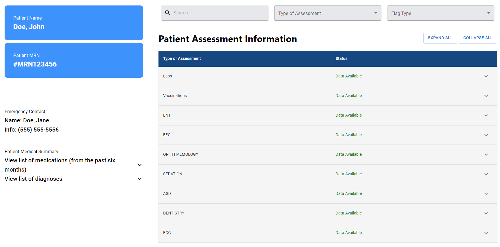
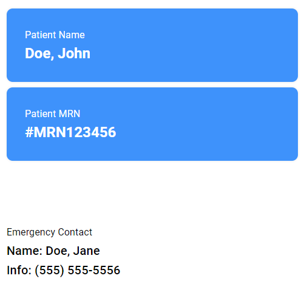
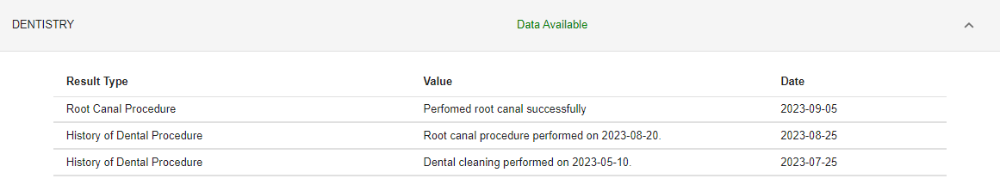
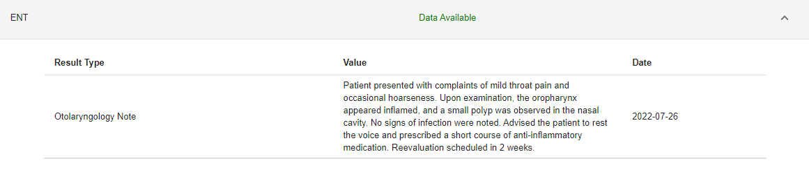

# User Guide

**Before Continuing with this User Guide, please make sure you have deployed the application.**

- [Deployment Guide](./DeploymentGuide.md)

| Index                              | Description                                                |
| :--------------------------------- | :----------------------------------------------------------|
| [Demo](#demo)                      | How to simulate EHR for app launch                         |
| [Dashboard](#dashboard)            | Explanantion of information displayed on dashboard         |
| [Configuration](#configuration)    | How to change the settings of the app                      |

## Demo 

To run the application, you will need to launch the application from a SMART on FHIR compliant EHR simulator. To start running the application locally run the command
```javascript
npm start
```

There are several EHR simulators available such as:
* [SMART App Launcher Sandbox](https://launch.smarthealthit.org/)
* [Cerner Code Console](https://code-console.cerner.com/)
* [Logica Health Sandbox](https://sandbox.logicahealth.org/)

## Dashboard
Once the application has been launched and a patient has been selected, a dashboard will appear that displays various information about a patient. On the left [sidebar](#sidebar) there is basic information about the patient and lists of the patient's medications and diagnoses. There is also a [table](#table) that displays more information about the patient such as labs and vaccinations. Above the table there are filters that can be used to search through the data in the table.



### Sidebar
The sidebar on the left contains basic information about the patient as well as the patient's medication and diagnoses information. 


#### Basic Patient Information
Basic information about the selected patient, such as name, MRN, and emergency contact information can be seen on the upper part of the left sidebar. 



#### Medications 
A list of medications presribed in the last six months can be seen on the left sidebar in a drop down panel. The name, status, and date of each medication are displayed. 


#### Diagnoses
A list of a patient's diagnoses can be seen on the left sidebar in a drop down panel. The name, status, and date of each diagnoses are displayed. 


### Table
The patient assessment information table contains various information about a patient's medical history. There are filters above the table that can be used to search through data in the table. 

The table contains two main columns:
* Type of Assessment: The name of the medical assessment
* Status: Indicates the availability of data
  * Data Available: Indicates that there is information available for that assessment
  * No Data: Indicates that there is no information available for that assessment

  

#### Labs
A list of labs and associated lab results can be found in the table. The type and date of each lab is displayed. Also, for each lab, the type, value, and date of the results of that lab are displayed in a drop down panel.


#### Vaccinations
A list of the patient's vaccinations are displayed in the table. For each vaccination, its name, status, and date are displayed.


#### Dentistry
Information about a patient's dental history is displayed in the table. For each entry, the name of the result, a value, and the result's date are displayed. 



#### ASD
Information related to a patient's history with Autism Spectrum Disorder (ASD) is displayed in the table. For each entry, the name of the result, a value, and the result's date are displayed. 


### Opthalmology
Information related to a patient's opthalmology history is displayed in the table. For each entry, the name of the result, a value, and the result's date are displayed. 


### Sedation
Information related to a patient's sedation history is displayed in the table. For each entry, the name of the result, a value, and the result's date are displayed.


### EEG
Information related to a patient's electroencephalogram (EEG) history is displayed in the table. For each entry, the name of the result, a value, and the result's date are displayed. 


### ECG
Information related to a patient's  electrocardiogram (ECG or EKG) history is displayed in the table. For each entry, the name of the result, a value, and the result's date are displayed. 


### ENT
Information related to a patient's ear, nose, and throat (ENT) history is displayed in the table. For each entry, the name of the result, a value, and the result's date are displayed. 




## Configuration
The configuration file `config.json` can be found in the folder `Optimizing-Sedation/frontend/src/config/`. 

There are several settings that you can configure within this file. 


### Launch Mode
The launch mode of the application can be configured. The launch mode be set to either `PUBLIC` or `PRIVATE`, depending on the type of app that is being launched. Changing this setting will change the way the app is launched. If the launch mode is set to `PRIVATE`, a `CLIENT SECRET` will need to be provided. 

To change the launch mode modify the `generalConfig.launchMode` property within the `config.json` file. 

### Maximum Size 
The maximum size of data that can be used in the API requests can be configured. This can be useful since API requests have a maximum size limit that can be handled. So this property can be configured to avoid any errors related to exceeding the request size limit. The size is in bytes.

To change the maximum request size modify the `generalConfig.maxSizeInByte` property within the `config.json` file. 


### Sandbox
There is a sandbox property that can be modified based on which sandbox the app is using. Sandboxes have different behaviours, so changing the app behaviours accordingly can help avoid errors. The sandbox property can be set to `CERNER`, `LOGICA`, or `SMART_LAUNCHER`.

To change the sandbox modify the `generalConfig.sandbox` property within the `config.json` file.

